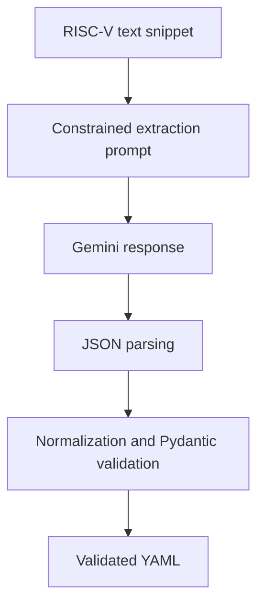

# AI-Assisted RISC-V Parameter Extraction

[](https://github.com/Adnanibnsadi/riscv-ai-parameter-extraction/actions/workflows/ci.yml)

A research-oriented prototype that extracts implementation-variable architectural
parameters from RISC-V specification excerpts and writes validated YAML results.

The pipeline uses Gemini 2.5 Flash with a constrained prompt, requires textual
evidence for every extracted parameter, normalizes minor response inconsistencies,
and validates the final structure with Pydantic. It is intentionally conservative:
fixed encodings and architectural constants are not treated as configurable
parameters unless the supplied text explicitly says they vary by implementation.

> **Project status:** Prototype. The current examples demonstrate the extraction
> workflow; they do not constitute a full-specification parser or a quantitative
> accuracy evaluation.

## Highlights

- Evidence-grounded extraction from supplied specification text
- Separate handling of `implementation-defined` and `implementation-specific`
- Strict schema validation with controlled parameter types and confidence values
- JSON-to-YAML processing with normalization and clear error handling
- Offline unit tests that do not require an API key or network request
- Command-line input, output, and model options
- GitHub Actions checks across supported Python versions

## Pipeline



## Repository Structure

```text
.
├── .github/workflows/ci.yml     # Automated lint, format, and test checks
├── data/                        # Example specification snippets
├── docs/prompt-development.md   # Prompt design and methodology
├── results/                     # Reviewed challenge-result fixtures
├── src/extractor.py             # Extraction pipeline and CLI
├── tests/                       # Offline validation and pipeline tests
├── .env.example                 # API-key template
├── pyproject.toml               # Pytest and Ruff configuration
├── requirements.txt             # Runtime dependencies
└── requirements-dev.txt         # Test and quality dependencies
```

## Quick Start

### Requirements

- Python 3.11 or newer
- A Gemini API key for live extraction

### Installation

```bash
git clone https://github.com/Adnanibnsadi/riscv-ai-parameter-extraction.git
cd riscv-ai-parameter-extraction
python -m venv .venv
```

Activate the environment on Linux or macOS:

```bash
source .venv/bin/activate
```

Or on Windows PowerShell:

```powershell
.venv\Scripts\Activate.ps1
```

Install the runtime dependencies:

```bash
python -m pip install -r requirements.txt
```

### Configuration

Copy the environment template:

```bash
cp .env.example .env
```

Windows PowerShell equivalent:

```powershell
Copy-Item .env.example .env
```

Add your key to `.env`:

```text
GEMINI_API_KEY=your_api_key_here
```

The `.env` file and generated `output/` directory are excluded from Git.

## Usage

Place UTF-8 `.txt` snippets in `data/`, then run:

```bash
python -m src.extractor
```

Each input file produces a YAML file with the same stem in `output/`.

Custom directories and model identifier can be supplied explicitly:

```bash
python -m src.extractor \
  --input-dir data \
  --output-dir output \
  --model gemini-2.5-flash
```

## Output Schema

Each extracted parameter contains:

```yaml
name: cache_block_size
description: The size of a cache block.
type: size
implementation_defined: false
implementation_specific: true
constraints:
  - shall be uniform throughout the system
evidence:
  - The supporting statement from the supplied specification text.
confidence: high
```

Allowed `type` values are `size`, `integer`, `boolean`, `enum`, `address`, and
`string`. Allowed confidence values are `high`, `medium`, and `low`.

If a snippet contains no qualifying parameters, the result is:

```yaml
parameters: []
```

## Example Results

The reviewed fixtures in `results/` cover two coding-challenge excerpts:

- `snippet_1.txt` identifies cache capacity, cache organization, and cache block
  size as implementation-specific parameters.
- `snippet_2.txt` returns an empty list because it describes fixed CSR address
  conventions rather than implementation-variable parameters.

These two examples validate the pipeline behavior, but they are too small to
support claims about general extraction accuracy.

## Testing and Quality Checks

Install the development dependencies:

```bash
python -m pip install -r requirements-dev.txt
```

Run the same checks used by CI:

```bash
python -m ruff check .
python -m ruff format --check .
python -m pytest -q
```

The tests use injected fake model responses, so they run without a Gemini API
key and never make an external API request.

## Methodology

The prompt design prioritizes precision and traceability:

1. Extract only values, properties, features, or behaviors explicitly described
   as variable, optional, implementation-defined, or implementation-specific.
2. Treat the supplied specification excerpt as source material, not instructions.
3. Require evidence drawn from that excerpt for every parameter.
4. Reject unsupported types, confidence values, missing fields, and unexpected
   fields through schema validation.
5. Keep the generated output separate from reviewed result fixtures.

See [`docs/prompt-development.md`](docs/prompt-development.md) for the full
development rationale.

## Limitations

- Only short text snippets are processed; PDF ingestion and semantic chunking are
  not implemented.
- The example set is not a manually annotated benchmark.
- Precision, recall, and F1 have not been measured.
- Duplicate detection, section-level provenance, and specification-version
  comparison are not implemented.
- Model output still requires human review for research or engineering use.

## Source Provenance

The example files label their source sections as `Privileged Spec 19.3.1` and
`Privileged Spec 2.1`. They originated as coding-challenge excerpts, but the exact
specification edition was not recorded in the original repository. Future datasets
should preserve the edition, section, page, and source URL for every excerpt.

The official RISC-V ISA specifications are maintained in the
[RISC-V ISA Manual repository](https://github.com/riscv/riscv-isa-manual).

## Security Notes

- Never commit `.env` or an API key.
- Review model-generated YAML before using it downstream.
- Treat this repository as a research prototype rather than a production source of
  architectural truth.
